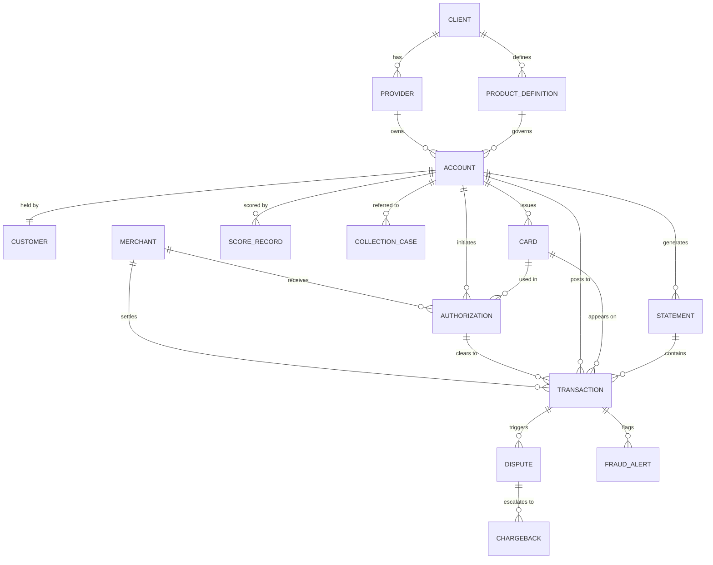

# tdgen-temporal

## Schema — Major Entities

---

## Daily Execution Sequence

- Each day, the simulator loads all active accounts and advances every entity through its lifecycle — updating account and card states, generating transactions, statements, and scores, then progressing any open disputes, fraud alerts, chargebacks, and collection cases — before persisting all changes to the database and exporting the day's delta files.

---

**Entry point:** `python -m tdgen_temporal.cli advance` → `DailyRunner.run(run_date)`

### Per-day steps (in order):

1. **Load active accounts** — fetch accounts with current temporal state from SQLite
2. **Account state machine** — evaluate payment due dates, delinquency transitions (ACTIVE → DELINQUENT → CHARGEOFF → CLOSED); open collection cases at 30-day delinquency
3. **Card state machine** — process expiry/replacements, trigger new card generation
4. **Score refresh** — emit SCORE_RECORD if `run_date.day == score_refresh_day` (config-driven)
5. **Transactions + authorizations** — generate daily TRANSACTION/AUTHORIZATION records per account (rate: mean/stddev from config), with fraud flags
6. **Statements** — emit STATEMENT records for accounts where `run_date.day == cycle_day`
7. **New disputes** — detect disputes from today's transactions via `dispute_rate`
8. **New fraud alerts** — detect fraud from today's transactions via `fraud_rate`
9. **Advance open disputes** — progress OPEN → RESOLVED/CHARGEBACK; may emit CHARGEBACK records
10. **Advance open fraud alerts** — progress OPEN → RESOLVED
11. **Advance open chargebacks** — update stage and representment status
12. **Advance collection cases** — move B1 → B2 → B3 → B4 → CHARGEOFF buckets
13. **Apply side effects** — card blocks, balance updates, account freezes
14. **Persist to database** — bulk insert/update all changed rows in SQLite
15. **Write delta files** — export to `output/deltas/{YYYY-MM-DD}/inserts/` and `updates/` (CSV + JSON)
16. **Update simulation clock** — record run metadata in `simulation_meta` table

---

**Modes:** `init` (seed Day 0), `advance` (run N days forward), `backfill` (loop over date range)
**State store:** SQLite WAL (`output/state.db`)
**Outputs:** Daily delta files (CSV/JSON) + database updates
