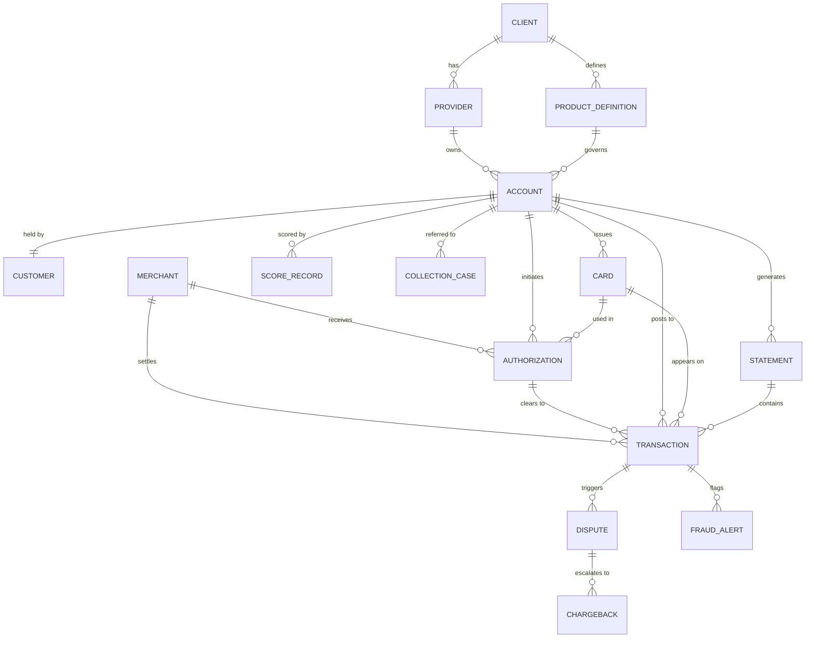

# TDGen-Temporal

**Schema-driven synthetic test data generator with temporal simulation.**

Load any relational schema, configure a scenario, and run a day-by-day simulation
that produces temporally consistent, referentially valid synthetic data — complete
with entity lifecycle, state transitions, and daily delta files for downstream
consumption.

The bundled demo is a TSYS TS2 credit-card portfolio (~40 tables). The engine is
domain-agnostic: the TSYS scenario is the reference example, not a hardcoded
assumption.

---

## Features

- **Temporal consistency** — every event (transaction, dispute, score) respects the open
  date of its parent entity; no event pre-dates its entity's existence
- **State machines** — accounts, cards, disputes, fraud alerts, chargebacks, and
  collection cases each have a declared lifecycle with valid state transitions
- **Configurable population and rates** — control entity counts, daily activity rates,
  fraud/dispute frequency, and lifecycle timings via a single YAML file
- **Daily delta export** — inserts and updates written per-table per-day as CSV and/or
  JSON, ready for ingestion into downstream pipelines or data warehouses
- **Web UI** — Streamlit dashboard with simulation controls, live schema ER diagram
  (zoom/pan), data explorer, validation results, and schema export/load
- **Validation** — built-in checks for temporal consistency, referential integrity,
  and state machine invariants; surfaced in the UI and CLI
- **CI pipeline** — lint (ruff), type check (mypy), unit tests on Python 3.10/3.11/3.12,
  and end-to-end smoke test on every push

---

## Prerequisites

| Tool | Version | Notes |
|---|---|---|
| Python | 3.10+ | https://www.python.org/downloads/ |
| Graphviz | 12.x | https://graphviz.org/download/ — add to PATH during install |
| Git | any | https://git-scm.com |

---

## Quick start

```powershell
# Clone and create virtual environment
git clone <repo-url> tdgen-temporal
cd tdgen-temporal
python -m venv .venv
.\.venv\Scripts\Activate.ps1

# Install dependencies
pip install -r requirements.txt

# Seed the simulation at a start date and run 30 days of history
python -m tdgen_temporal.cli init --date 2024-01-01
python -m tdgen_temporal.cli advance --days 30

# Launch the web UI (opens browser automatically)
.\launch_ui.bat
```

The web UI is at **http://localhost:8501**.

---

## CLI reference

```powershell
# Seed a fresh simulation (wipes any existing database)
python -m tdgen_temporal.cli init --date YYYY-MM-DD

# Advance N days forward from the current simulation date
python -m tdgen_temporal.cli advance --days N

# Fill an explicit date range (inclusive)
python -m tdgen_temporal.cli backfill --from YYYY-MM-DD --to YYYY-MM-DD

# Show current date, total runs, and row counts for all tables
python -m tdgen_temporal.cli status

# Run all validation checks (--errors-only suppresses passing rows)
python -m tdgen_temporal.cli validate --errors-only
```

All commands default to `--db output/state.db` and `--config config/scenario.yaml`.

---

## Web UI

Double-click **`launch_ui.bat`** or run `streamlit run ui/app.py`.

| Tab | What it does |
|---|---|
| ⚙️ **Control Panel** | Edit `scenario.yaml`, run Init / Advance / Backfill / Reset; live sidebar shows entity and event counts |
| 🗂️ **Schema** | Interactive ER diagram (scroll to zoom, drag to pan); group filters; export as JSON or SQL DDL; load any external schema JSON |
| 📊 **Dashboard** | Account status distribution, daily transaction volume, balance distribution, simulation timeline |
| 🔍 **Data Explorer** | Browse any table with row limit control |
| ✅ **Validation** | Run integrity checks; shows pass/fail with row-level detail |

---

## Configuration

Edit `config/scenario.yaml` before running `init` or `advance`.

```yaml
simulation:
  seed: 42             # Change for a different reproducible dataset
  locale: en_CA        # Faker locale for names, addresses, phone numbers
  initial_population:
    accounts:   500    # Entities seeded on Day 0  ← requires re-init to change
    merchants:  200
    clients:      3
    providers:  10
    products:   20

rates:
  transactions_per_account_per_day_mean:   1.8   # Daily event volume
  fraud_rate:              0.002                  # Fraction of purchases flagged
  dispute_rate:            0.003                  # Fraction of transactions disputed
  chargeback_rate:         0.40                   # Fraction of disputes that escalate
  payment_probability:     0.65                   # Probability of on-time payment

lifecycle:
  dispute_investigating_days:  7     # Days until OPEN → INVESTIGATING
  dispute_resolution_days:    30     # Max days before force-close
  collection_bucket_thresholds:
    B1:  30   # Days past due for each delinquency bucket
    B2:  60
    B3:  90
    B4: 120
    CHARGEOFF: 180
```

`initial_population` values require a fresh `init`.
All `rates` and `lifecycle` values take effect on the next `advance` or `backfill`.

---

## Architecture

### How a simulated day works

The daily runner executes 16 ordered steps on each call to `advance`:

1. Load all active entities from SQLite (joined with their temporal state)
2. Run the **Account** state machine — evaluate payment due dates, delinquency transitions (ACTIVE → DELINQUENT → CHARGEOFF → CLOSED)
3. Run the **Card** state machine — process expiry, issue replacements
4. Emit **Score records** for accounts whose refresh day matches `run_date.day`
5. Generate **Transactions + Authorisations** per account (Gaussian rate from config)
6. Emit **Statements** for accounts whose cycle day matches `run_date.day`
7. Open new **Disputes** from today's transactions at the configured `dispute_rate`
8. Open new **Fraud alerts** from today's flagged transactions
9. Advance all open **Disputes** through their lifecycle
10. Advance all open **Fraud alerts** through their lifecycle
11. Advance all open **Chargebacks** through their lifecycle
12. Advance all open **Collection cases** through their lifecycle
13. Apply **side effects** (card blocks from confirmed fraud, balance adjustments)
14. **Persist** all changes to SQLite (bulk insert new rows, update changed rows)
15. Write **delta files** to `output/deltas/YYYY-MM-DD/inserts/` and `updates/`
16. Update `simulation_meta` and `run_log`

### State machines

| Entity | States |
|---|---|
| Account | ACTIVE → DELINQUENT → CHARGEOFF → CLOSED |
| Card | ACTIVE → EXPIRED \| BLOCKED |
| Dispute | OPEN → INVESTIGATING → RESOLVED → CLOSED \| WITHDRAWN |
| Fraud alert | OPEN → UNDER_REVIEW → CONFIRMED \| FALSE_POSITIVE → CLOSED |
| Chargeback | FIRST_CHARGEBACK → REPRESENTMENT → PRE_ARBITRATION → WON \| LOST |
| Collection case | ACTIVE → AGENCY_REFERRAL \| PROMISE_TO_PAY → CHARGEOFF → CLOSED |

### Entity relationships (TSYS TS2 demo)


```mermaid
erDiagram
    CLIENT ||--o{ PROVIDER : "has"
    CLIENT ||--o{ PRODUCT_DEFINITION : "defines"
    PROVIDER ||--o{ ACCOUNT : "owns"
    PRODUCT_DEFINITION ||--o{ ACCOUNT : "governs"
    ACCOUNT ||--|| CUSTOMER : "held by"
    ACCOUNT ||--o{ CARD : "issues"
    ACCOUNT ||--o{ STATEMENT : "generates"
    ACCOUNT ||--o{ SCORE_RECORD : "scored by"
    ACCOUNT ||--o{ COLLECTION_CASE : "referred to"
    MERCHANT ||--o{ AUTHORIZATION : "receives"
    MERCHANT ||--o{ TRANSACTION : "settles"
    ACCOUNT ||--o{ AUTHORIZATION : "initiates"
    CARD ||--o{ AUTHORIZATION : "used in"
    AUTHORIZATION ||--o{ TRANSACTION : "clears to"
    ACCOUNT ||--o{ TRANSACTION : "posts to"
    CARD ||--o{ TRANSACTION : "appears on"
    STATEMENT ||--o{ TRANSACTION : "contains"
    TRANSACTION ||--o{ DISPUTE : "triggers"
    TRANSACTION ||--o{ FRAUD_ALERT : "flags"
    DISPUTE ||--o{ CHARGEBACK : "escalates to"
```

### Output structure

```
output/
├── state.db                       # SQLite WAL database (single source of truth)
└── deltas/
    └── 2024-01-15/
        ├── inserts/
        │   ├── TRANSACTION.csv
        │   ├── TRANSACTION.json
        │   ├── AUTHORIZATION.csv
        │   └── ...
        └── updates/
            ├── ACCOUNT.csv
            └── ...
```

---

## Project structure

```
tdgen-temporal/
├── config/
│   ├── scenario.yaml              # Simulation parameters
│   └── tsys_ts2_schema.json       # Exported TSYS TS2 schema (demo file for Schema tab)
├── docs/
│   └── REBUILD_PROMPT.md          # Full technical spec — used to regenerate with Claude Code
├── tdgen_temporal/                # Core Python package
│   ├── cli.py                     # CLI entry point
│   ├── schema.py                  # Schema extraction, ER diagram, JSON/DDL export
│   ├── db/
│   │   ├── migrations.py          # All DDL (CREATE TABLE statements)
│   │   └── state_store.py         # All database access (no ORM)
│   ├── engine/
│   │   ├── init_runner.py         # Day 0 seeding
│   │   ├── daily_runner.py        # Per-day orchestration
│   │   └── backfill_runner.py     # Date-range loop
│   ├── generators/
│   │   ├── field_generators.py    # Luhn cards, SIN, Faker wrappers
│   │   ├── ref_tables.py          # Reference data rows
│   │   ├── seed.py                # Day 0 population
│   │   ├── transaction.py         # Transaction + authorisation generation
│   │   └── statement.py           # Monthly statement generation
│   ├── output/
│   │   └── delta_writer.py        # CSV/JSON delta files per day
│   ├── state_machines/            # One file per entity lifecycle
│   └── validators/                # Temporal, referential, and state checks
├── tests/
│   └── test_smoke.py              # Import checks and core unit tests
├── ui/
│   └── app.py                     # Streamlit web dashboard
├── .github/workflows/
│   └── ci.yml                     # CI: lint → typecheck → tests → smoke test
├── pyproject.toml                 # Build, ruff, mypy, pytest config
├── requirements.txt               # pip install target
├── launch_ui.bat                  # Double-click to start the web UI on Windows
└── REBUILD.md                     # Complete guide to reproduce this project
```

---

## Development

```powershell
# Activate venv
.\.venv\Scripts\Activate.ps1

# Run tests
pytest tests/ -v

# Lint and format
ruff check .
ruff format .

# Type check
mypy tdgen_temporal

# Full end-to-end check (mirrors CI smoke test)
python -m tdgen_temporal.cli init --date 2024-01-01
python -m tdgen_temporal.cli advance --days 7
python -m tdgen_temporal.cli validate --errors-only
```

### CI pipeline

Every push runs four GitHub Actions jobs:

| Job | Tool | Scope |
|---|---|---|
| Lint | ruff | Format check + lint rules |
| Type check | mypy | Static type analysis |
| Tests | pytest | Python 3.10, 3.11, 3.12 matrix |
| Smoke test | CLI | init → advance 7 days → validate end-to-end |

### Pre-commit hooks

```powershell
pip install pre-commit
pre-commit install
```

Runs ruff format + ruff check on every commit.

---

## Rebuilding from scratch

`REBUILD.md` in the project root is a complete guide for reproducing this project
on a new machine — including how to use Claude Code with `docs/REBUILD_PROMPT.md`
to regenerate the engine if you don't have repository access.

---

## Roadmap

Agreed directions for future sprints:

- **Generic schema-driven engine** — configurable entities, state machines, and event
  generators driven by the loaded schema rather than hardcoded domain logic
- **Field inference and generation hints** — Faker heuristics for standard fields;
  `generation` hints in schema JSON for domain-specific enumerations
- **Confluence schema ingestion** — pull a schema from a Confluence page via REST API;
  parse the table into the internal schema JSON format
- **Intranet deployment** — Windows service (NSSM), reverse proxy (IIS/nginx), Windows
  Authentication SSO

---

## Authors

Fred Ferguson · CGI
